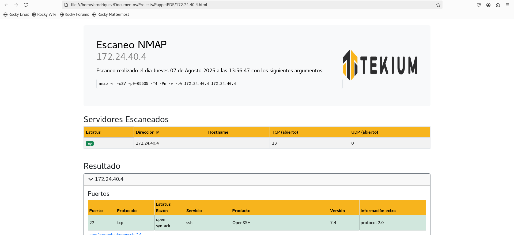
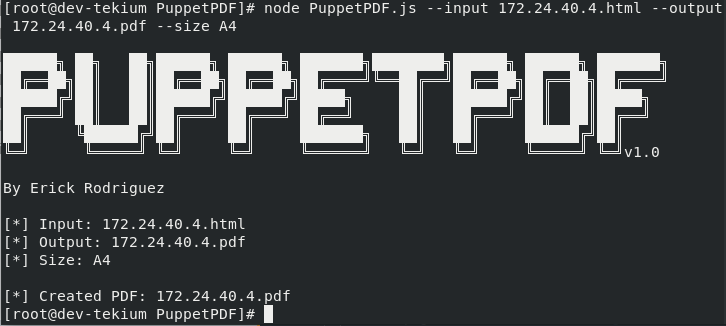
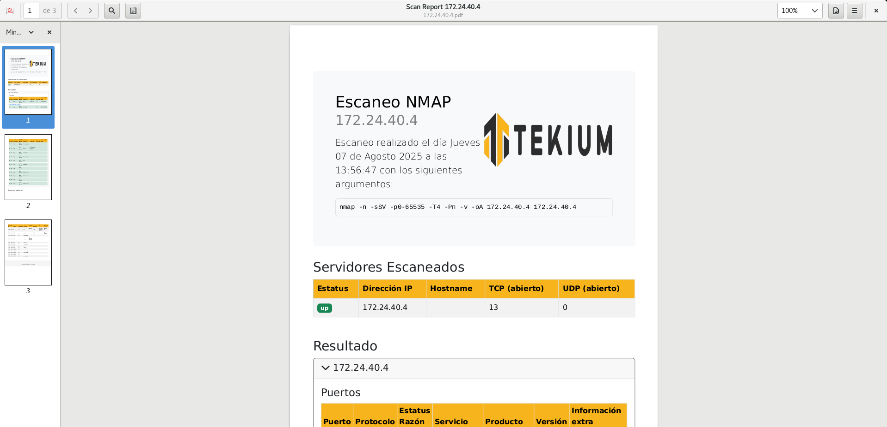

# PuppetPDF
PuppetPDF is a blazing-fast Node.js CLI tool that converts HTML files into pixel-perfect PDFs using [Puppeteer](https://pptr.dev/).  
Built for developers, sysadmins, and automation workflows that demand precision, style fidelity, and full control over output.

## Features
- Converts HTML to PDF with full CSS and image support.
- Preserves colors, layout, and print styles.
- Optimized for enterprise reports and multi-table documents.
- CLI-ready with argument parsing.
- Works headlessly with Puppeteer and Chromium.

## Installation

Clone the repo and install dependencies:

```
git clone https://github.com/erickrr-bd/PuppetPDF.git
cd PuppetPDF
npm install
```
## Requirements
- Node.js ≥ 18
- Internet access (if your HTML loads remote resources)
- Chromium (bundled with Puppeteer)

## Usage
```
usage: node PuppetPDF.js [--input] [--output]

optional arguments:
  --input       Path to the HTML file
  --output      Path to save the generated PDF
```

## Example
```
node PuppetPDF.js --input 172.24.40.4.html --output 172.24.40.4.pdf
```
An HTML document is displayed with defined colors and styles.



Using the PuppetPDF tool, you indicate that the HTML file will be converted to PDF.



It is observed that the PDF file was generated correctly, maintaining the styles and colors defined in the HTML.


